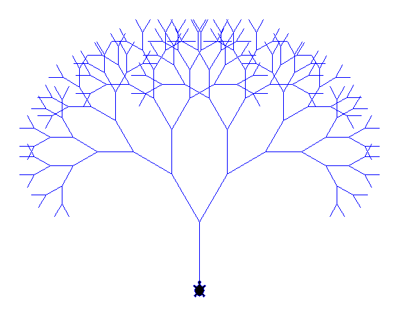
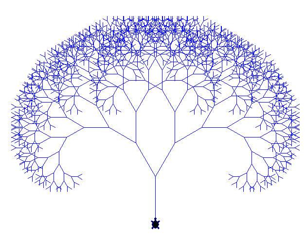
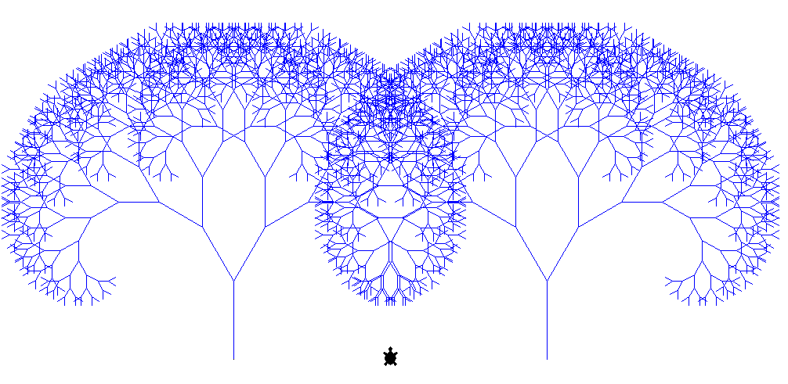
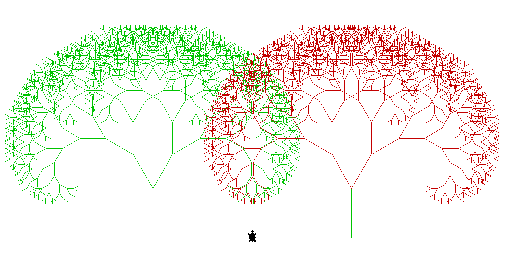
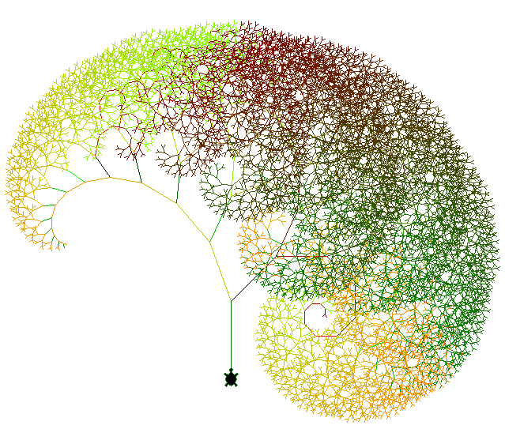
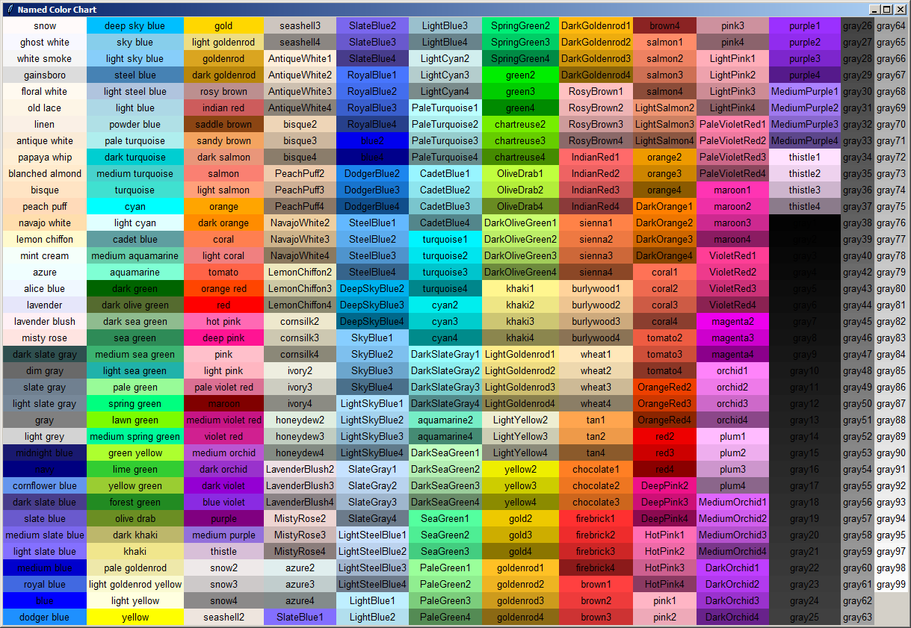

# Tina's Trees

## Eindopdracht programmeren

Wij gaan door middel van een _recursieve_ functie Tina een fractal laten tekenen.

1.  Dinsdagochtend is er een algemene inleiding waarin we een eerste versie van de code zullen maken en beschikbaar stellen.
2.  Vervolgens is er per klas een vragenuurtje.
3.  Je gaat vervolgens zelf met de code aan de slag om hier een verbetering is aan te brengen. Denk bijvoorbeeld aan het gebruik van _kleur_, andere regels voor het tekenen van takken, een ander aantal takken per generatie, het tekenen van bladeren, etc.
4.  Dinsdagmiddag lever je je plan van aanpak in via moodle.
5.  Donderdag lever je je eindproduct in via moodle. Dit is zowel je _volledige code_ als een _screenshot van het resultaat_.

## Hints

-   Sla je code vaak op _met een nieuwe bestandsnaam_. Zo raak je geen werk kwijt.
-   Je kunt hiervoor het beste werken met Thonny. Mocht je geen beschikking hebben over Thonny (chromebook bijvoorbeeld) dan kun je werken via [repl.it](https://repl.it/). Als dit nodig is vraag dan tijdens het vragenuurtje hulp aan je docent.
-   Het uitvoeren van code zoals deze kan met de verkeerde instellingen _heel erg lang_ duren. Test de snelheid van je code (en gebruik `tina.speed(0)`).

# Suggesties / Voorbeelden

## tree_cutoff.py

## tree_color.py

## tree_full.py

## Nuttige functies

### Window-functies

-   `tina.getscreen().exitonclick()` - Als Tina klaar is met tekenen sluit het venster. Als je dit toevoegt als laatste regel van je programma blijft het scherm open staan tot je ergens erin klikt. Zo kun je een screenshot ervan maken.

### Tekenfuncties

-   `pensize(grootte)` - De `grootte` is hier de dikte van de lijn die tina tekent in pixels.
-   `circle(diameter)` - Tekent een cirkel met diameter `diameter`.
-   `dot(diameter)` - Tekent een stip met diameter `diameter`.

### Kleurfuncties

De `kleur` die je hier invult kan de naam van de kleur zijn "white", "green", "purple" etc. (een volledige klijst van alle mogelijke namen staat hieronder) maar ook een _RGB-tuple_: Dit is tussen haakjes een lijst van 3 getallen tussen 0.0 en 1.0 die de kleurwaarde in rood, groen en blauw voorstellen. `(1.0, 0.0, 1.0)` is bijvoorbeeld paars.

-   `pencolor(kleur)` - Stelt de penkleur van tina in.
-   `tina.getscreen().bgcolor(kleur)` - Past de achtergrondkleur aan.

De volledige documentatie is [hier](https://docs.python.org/3.8/library/turtle.html) te vinden.
